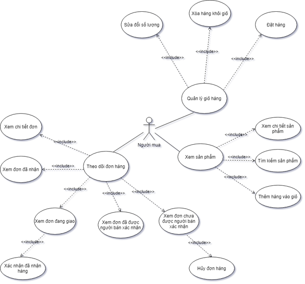
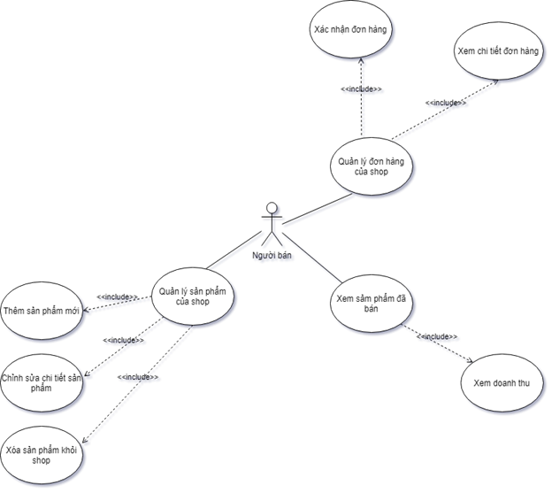
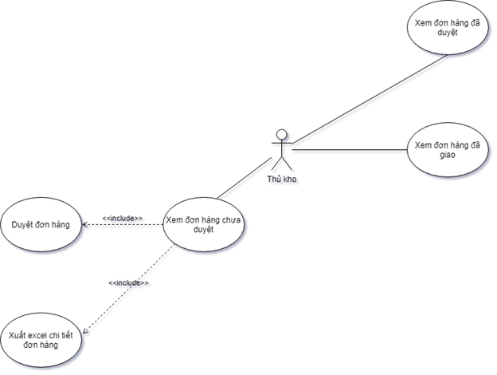

# MVC_WebThuongMaiDienTu
## Trang web sẽ có các thành phần user bao gồm: người mua hàng, người bán hàng và người thủ kho.
### Người mua: có thểm thêm hàng vào giỏ hàng, đặt hàng, theo dõi đơn hàng, hủy đơn hàng khi đơn hàng chưa được người bán xác nhận gửi đi.
### Người bán: có chức năng đăng sản phẩm, các thông tin liên quan về sản phẩm lên web, duyệt các đơn hàng mới sau khi bắt đầu gửi hàng về kho tập kết.
### Thủ kho: sẽ có chức năng duyệt đơn hàng và xuất file excel về thông tin, chi tiết đơn hàng khi mà đã nhận được hàng của người bán gửi về kho tập kết hàng.

- UseCase người mua hàng

- UseCase người bán hàng

- UseCase người thủ kho

